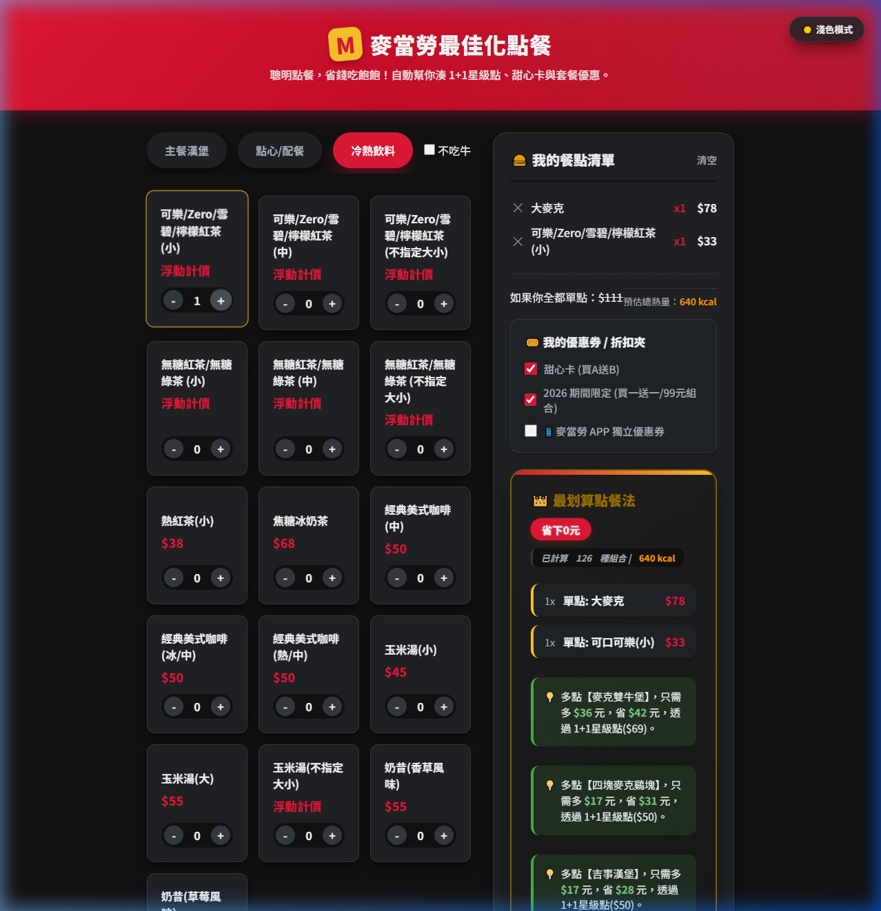

# McDonald's Ordering Optimizer | 麥當勞點餐優化器

A high-performance web application designed to find the most cost-effective combination for McDonald's orders using dynamic programming. Specifically tuned for the 2026 Taiwan market.  
這是一個高效能的 Web 應用程式，利用動態規劃（Dynamic Programming）演算法，為您的麥當勞訂單尋找最省錢的組合。特別針對 2026 台灣市場進行優化。


## ✨ Features | 功能亮點

- **🏆 Dynamic Optimizer | 動態優化引擎**: Uses memoized state-space search to guarantee the lowest possible price.  
  使用記憶化狀態空間搜索，確保輸出全球最低價。
- **🏷️ 2026 Promo Support | 2026 最新優惠**: Deep integration with current promotional schemes (Sweetheart Card, 1+1, App Coupons).  
  完整整合甜心卡、1+1=$50/$69、APP 專屬優惠與隱藏酷碰。
- **🔥 Turbo Engine | 渦輪性能**: Response time <10ms even for complex orders.  
  即便處理大型組合，運算速度依然維持在 10 毫秒以下。
- **🥗 Nutrition Tracking | 最省熱量追蹤**: Real-time kcal summation for both cart and strategy.  
  清單與點餐方案皆提供即時熱量（kcal）估計與統計。
- **🌓 Dual Themes | 雙色主題**: Premium dark and light mode support with glassmorphism UI.  
  極致質感的深色/淺色模式切換，搭配毛玻璃視覺設計。

## 🛠️ Tech Stack | 技術棧

- **Core**: Vanilla HTML5, CSS3, JavaScript (ES6+)
- **Algorithm**: State-space search with memoization
- **Design**: Glassmorphism, Modern typography, Responsive grid

## 🚀 Quick Start | 快速入門

1. Clone the repository | 複製檔案庫:
   ```bash
   git clone https://github.com/Aiersenlan/mcdonalds-optimizer.git
   ```
2. Open `index.html` in any browser | 開啟 `index.html` 即可使用。
3. Add items to find your best strategy! | 加入餐點，即刻省錢！

## 🌐 Deployment | 雲端佈署

This project is a static site. To deploy on **Render**:
1. Create a new **Static Site** on Render.
2. Connect your GitHub repository.
3. Render will use the included `render.yaml` automatically.

本專案為純靜態網頁。若要佈署至 **Render**:
1. 在 Render 上建立新的 **Static Site**。
2. 連結您的 GitHub 檔案庫。
3. Render 會自動讀取內附的 `render.yaml` 進行設定。

## 📸 Screenshots | 介面展示



## 📄 License

MIT License. Open for contribution.
